[TOC]

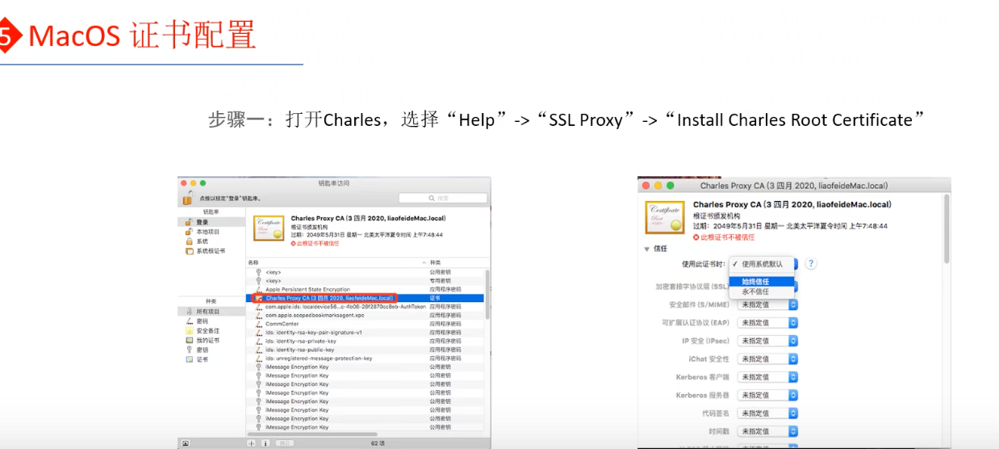

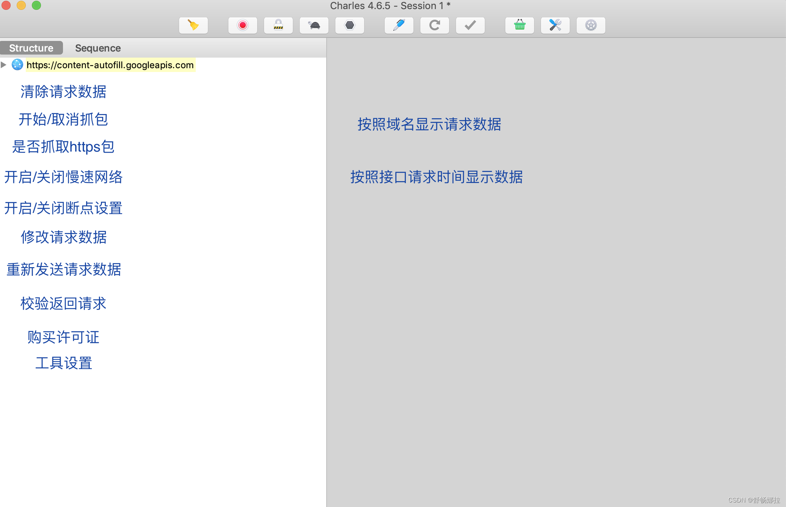

# MacOS 抓包工具Charles：安装与使用

### 安装

1. 工作原理
2. 组件介绍
3. 代理配置
  4.1 Charles 代理配置
  4.2 客户端-MacOS
  4.2.1 代理配置
  4.2.2 证书配置
  4.3 客户端-IOS
  4.3.1 代理配置
  4.3.2 证书配置
4. 使用
  5.1 抓包分析
  5.2 断点调试
  5.2.1 断点配置
  5.2.2 断点分析
  5.3 弱网测试
  5.3.1 流量配置：模拟2G/3G/4G网络等
  5.3.2 弱网测试
  5.4 map 功能
  （1）map remote 远程映射
  （2） map local 本地映射
  5.5 Rewrite 功能

参考视频：https://www.bilibili.com/video/BV1mQ4y1N7dn?p=10

1. 安装
官网下载安装包（官网free 30 days）

https://www.charlesproxy.com/latest-release/download.do

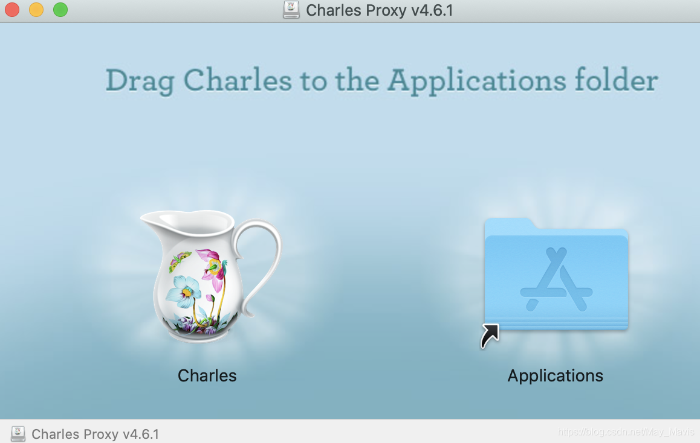

同意获取一个权限

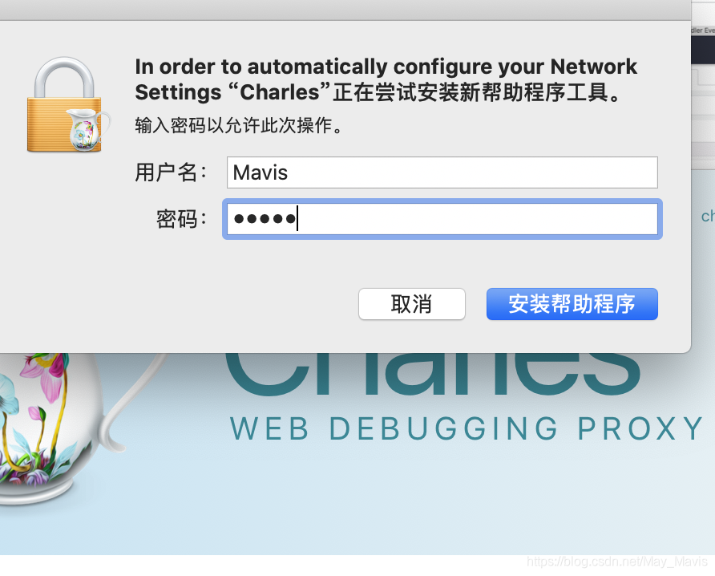

打开App后显示如下界面：

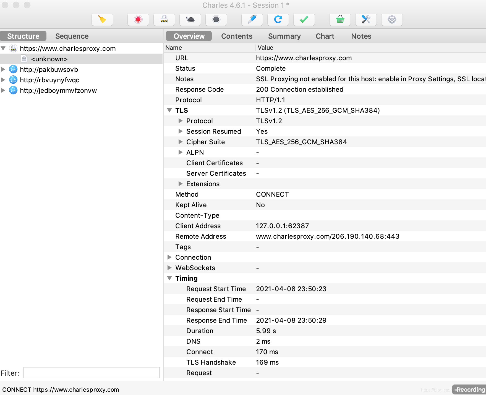

2. 工作原理

   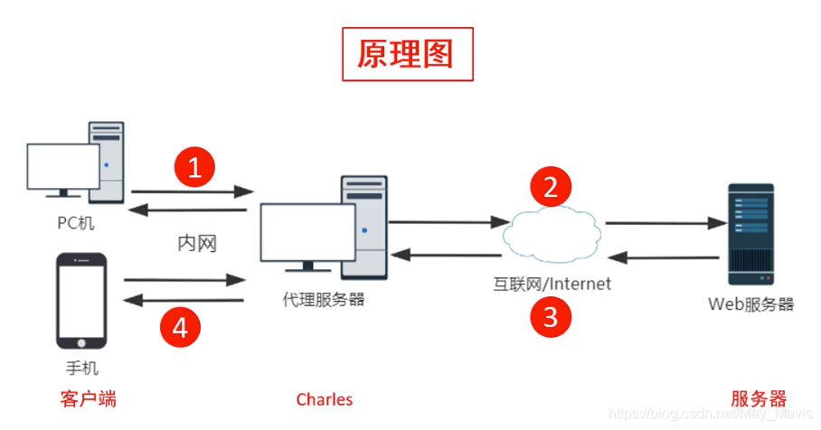

### 步骤：

1、客户端发送请求
2、Charles接收再发送给服务端
3、服务端返回请求结果给Charles
4、由Charles转发给客户端

3. ### 组件介绍

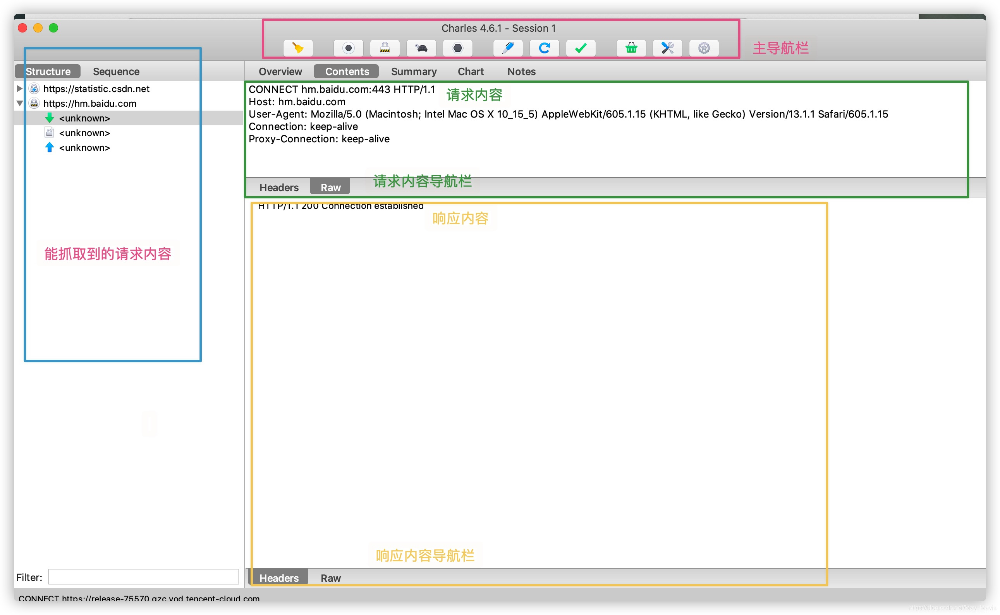

4. ### 代理配置

  4.1 Charles 代理配置

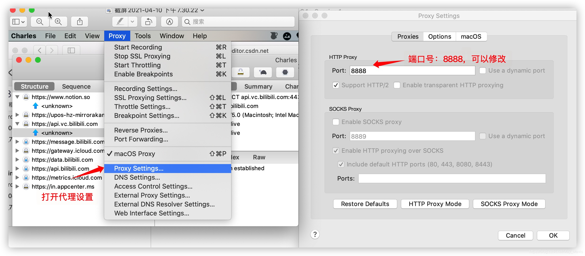

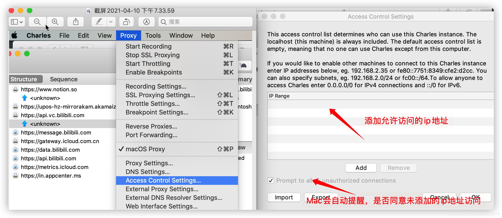

4.2 客户端-MacOS

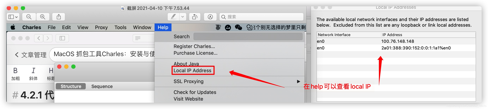

4.2.1 代理配置
当charles和所抓包web不在一台服务器

系统偏好设置-网络-右下角的高级选项，将http和https均输入ip地址和端口号：

ip地址：哪台电脑安装的charles则输入哪台电脑的ip地址
（在charles里可以查看电脑的ip地址）!

当charles和所抓包web在同一服务器

4.2.2 证书配置
在请求和响应中会显示乱码，在抓取内容界面显示unknown，则需要安装SSL证书，从而可以看到正确的报文信息

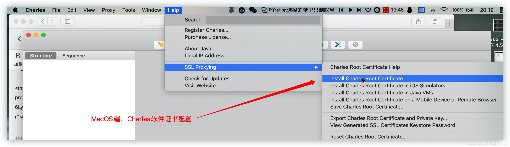

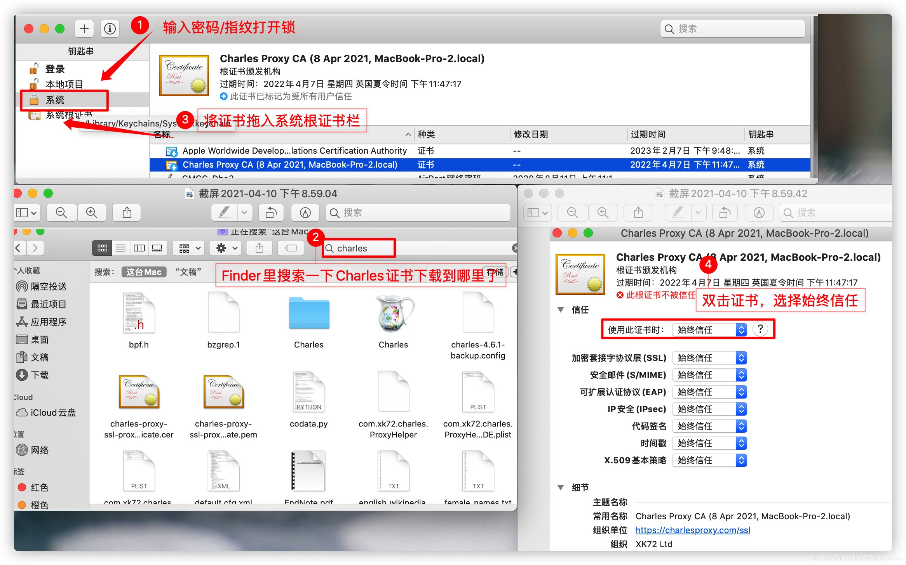

安装完后配置Charles

亲测有效！不再乱码！

### 4.3 客户端-IOS

4.3.1 代理配置
步骤：
1、ios手机中选择“设置”-“无线局域网”
2、点击已连接的无线网络名称
3、在HTTP代理的配置代理中选择“手动”
4、输入服务器IP地址及端口号

4.3.2 证书配置
步骤：
1、ios端设置好代理配置
2、浏览器栏输入https://charlesproxy.com/getssl下载并信任文件
3、“通用”-“证书信任设置”-开启

5. 使用
5.1 抓包分析
Charles代理配置-客户端代理配置-操作客户端软件-分析请求数据
通过客户端软件发出的请求报文，在charles中观察请求和响应情况，判断错误的提示信息是由前端还是后端返回的，从而得出bug位置

5.2 断点调试
5.2.1 断点配置

5.2.2 断点分析
观察数据返回结果，判断bug位置是前端还是后端

5.3 弱网测试
5.3.1 流量配置：模拟2G/3G/4G网络等

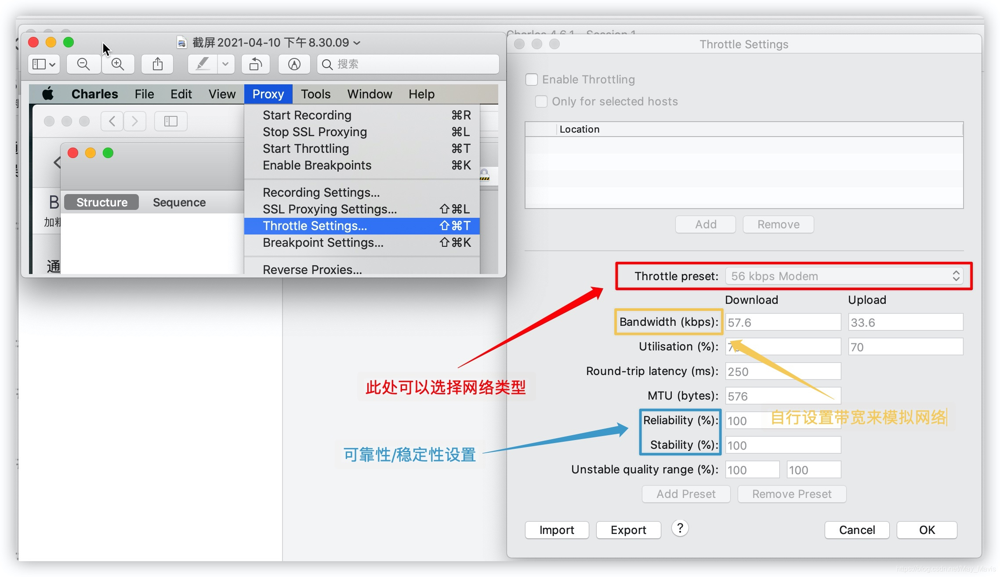

### 5.3.2 弱网测试

分析相关时间数据，响应时间慢
分析页面展示状态，弱网状态下，APP加载慢，会不会导致崩溃
5.4 map 功能
重定向redirect：通过各种方法将各种网络请求重新定个方向转到其他位置
重定向状态码：301
map功能：将某个请求进行重定向，用重定向的内容来响应请求的内容
作用：将某个接口重定向到指定的测试环境中，这样就可以测试一下效果如何了
（1）map remote 远程映射
将某个网络请求重定向到另一个网络请求

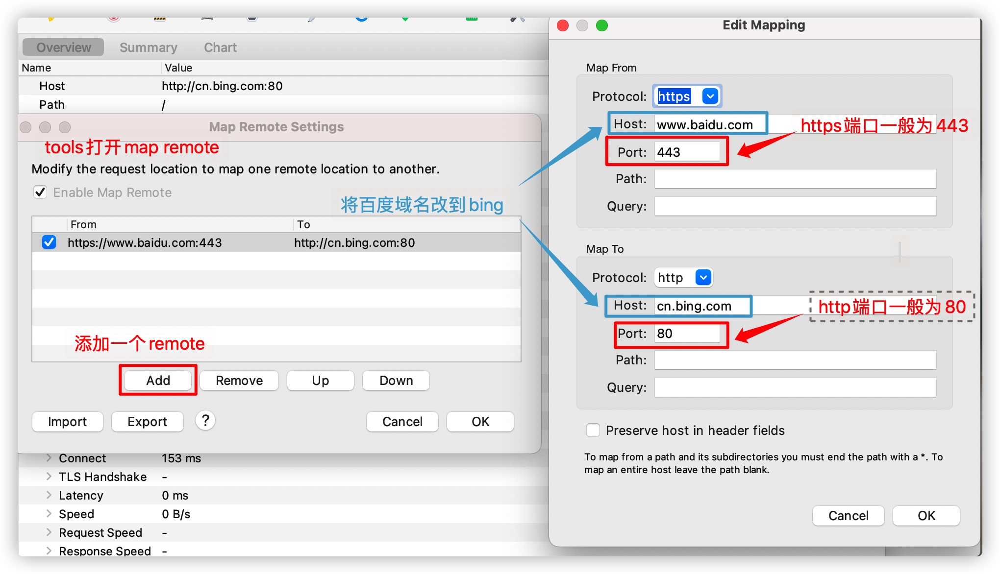

（2） map local 本地映射
将某个网络请求重定向到本地的某个文件

### 5.5 Rewrite 功能

可用于修改请求和返回的工具，可以重写